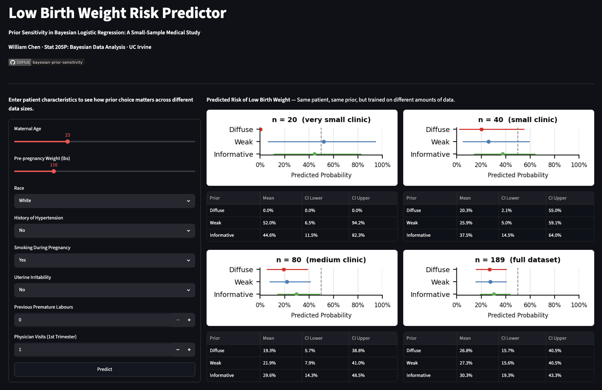

# Prior Sensitivity in Bayesian Logistic Regression: A Small-Sample Medical Study
[](report/birthwt_report.pdf)

Bayesian logistic regression on the `birthwt` dataset (n=189), comparing three prior specifications (diffuse N(0,100), weakly informative N(0,2.5), and clinically informed) across sample sizes n ∈ {20, 40, 80, 189}.

At full sample all three priors converge (AUC ≈ 0.747, LOOIC difference < 4). At n=20 the diffuse prior collapses under complete separation while the regularizing priors stay stable. The key finding: stabilization is governed not by sample size but by positive-case count. Smoking (74/189) stabilizes by n=40, while hypertension (12/189) persists until n=80.

[See key results →](#key-results)

## Motivation

Most modeling projects optimize for accuracy. This one asks a different question: when should you trust your model's output at all?

In clinical settings, n < 100 is common. Under small samples, a model can achieve near-perfect accuracy not because it predicts well, but because it has memorized the data under complete separation. Standard metrics won't tell you this. Pareto k̂ diagnostics will.

This project treats model building as a diagnostic exercise: comparing three priors across subsamples not to find the best-performing one, but to expose where each prior's influence dominates the data, and why some predictors are more vulnerable than others. The answer (predictor rarity, not sample size) is the kind of finding that changes how you approach a new dataset before you even fit a model.

## Interactive Demo

Enter a patient's characteristics (age, smoking status, race, etc.) and the app returns predicted probability of low birth weight from all three priors across four sample sizes. At n=20, the diffuse prior collapses to near-certainty while the informative prior retains honest uncertainty.



## Design Decisions

**Why three priors?**

- **Diffuse N(0,100)**: a common default that lets the data speak freely
- **Weak N(0,2.5)**: acts as a regularizer without encoding strong beliefs
- **Informative**: sets N(1,0.5) for `smoke` and `ht`, corresponding to OR ≈ 2.7 (±2 SD: OR ∈ [1.4, 7.4]), in the expected direction given published risk estimates

**Why LOOIC and Pareto k̂ instead of in-sample AUC?**

Under complete separation, in-sample AUC becomes a measure of overfitting rather than predictive ability. LOOIC and Pareto k̂ diagnostics provide a more honest assessment: k̂ > 0.7 flags observations where the LOO estimate is unreliable, directly exposing which prior and sample size combinations are unstable.

**Why repeated subsampling?**

A single random draw at each n risks mistaking a lucky (or unlucky) sample for a general pattern. Running 100 independent draws per n and recording the explosion rate (|β̂| > 10) converts a single observation into a distributional claim, making the stability thresholds reproducible rather than coincidental.

## Key Results

**The key finding:** stabilization is not uniform across predictors. The threshold is governed not by sample size alone, but by positive-case count: a predictor with 74 positive cases stabilizes far earlier than one with 12, even at the same n.

**Full data (n=189): prior choice is inconsequential**

| Model | LOOIC | AUC |
|-------|-------|-----|
| Diffuse | 223.85 | 0.746 |
| Weak | 223.32 | 0.747 |
| Informative | 220.43 | 0.748 |

**Small samples: prior choice is decisive**

| n | Model | AUC | LOOIC | Pareto k̂ > 0.7 |
|---|-------|-----|-------|-----------------|
| 20 | Diffuse | 1.000 | 8.3 | 20 |
| 20 | Weak | 0.952 | 28.1 | 5 |
| 20 | Informative | 0.905 | 27.1 | 1 |
| 40 | Diffuse | 0.808 | 65.3 | 4 |
| 40 | Weak | 0.799 | 61.1 | 0 |
| 40 | Informative | 0.750 | 56.3 | 1 |
| 80 | Diffuse | 0.789 | 105.9 | 0 |
| 80 | Weak | 0.785 | 102.4 | 1 |
| 80 | Informative | 0.777 | 98.2 | 0 |

**Repeated subsampling (100 draws per n, diffuse prior)**

| Predictor | n=20 explosion rate | n=40 explosion rate | n=80 |
|-----------|--------------------|--------------------|------|
| smoke1 | 13.0% | 1.0% | 0% |
| ui1 | 17.5% | 3.0% | 1% |
| ht1 | 31.1% (+26% undefined) | 17.6% | 0% |

## Reflections & Next Steps

The key finding is a threshold effect, not a gradient: stabilization is a step function governed by positive-case count. Rare binary predictors are precisely the ones clinicians care most about, and they are the last to shed prior influence. This pattern is likely to generalize to other clinical datasets.

Next steps:
- **k-fold CV** at small n: LOO becomes unreliable when k̂ > 0.7; 10-fold CV would provide more trustworthy estimates at n=20
- **Multi-dataset validation**: replicate the rarity threshold finding on other small clinical datasets to assess generalizability
- **Hierarchical priors**: partial pooling across predictor groups as an alternative to hand-specifying informative priors

## Repository

```
app/
  ├── plumber.R                  # AWS-deployed API
  ├── app.py                     # Streamlit frontend
  └── requirements.txt
code/
  └── birthwt_analysis.ipynb     # Main analysis (R notebook)
figures/
  └── *.png                      # All report figures
report/
  └── birthwt_report.pdf         # Full analysis writeup
```

## Tools

**Statistical methods**: Bayesian logistic regression, LOO-CV, Pareto k̂ diagnostics, repeated subsampling  
**Language**: R  
**Libraries**: rstanarm, loo, pROC, ggplot2, dplyr  
**Deployment**: AWS S3 + EC2, Streamlit

## References

Simpson, W.J. (1957). A preliminary report on cigarette smoking and the incidence of prematurity. *American Journal of Obstetrics and Gynecology*, 73(4), 807–815.

Shah, N.R., & Bracken, M.B. (2000). A systematic review and meta-analysis of prospective studies on the association between maternal cigarette smoking and preterm delivery. *American Journal of Obstetrics and Gynecology*, 182(2), 465–472.

Hosmer, D.W., Lemeshow, S., & Sturdivant, R.X. (2013). *Applied Logistic Regression* (3rd ed.). Wiley. [source of `birthwt` dataset]